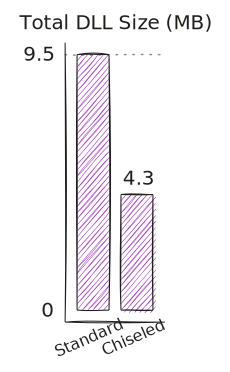

# ChiseledSqlClient

> [!IMPORTANT]  
> ChiseledSqlClient was an experiment that eventually lead to [Chisel](https://github.com/0xced/Chisel), a NuGet package which greatly simplifies the removal of unwanted dependencies and properly handles transitive dependencies.

---

As of version 5.2.0, the [Microsoft.Data.SqlClient](https://www.nuget.org/packages/Microsoft.Data.SqlClient) NuGet package includes everything needed to authenticate to SQL databases with the Microsoft identity platform (formerly Azure AD). It has been suggested to [split Azure dependent functionality in a separate NuGet Package (#1108)](https://github.com/dotnet/SqlClient/issues/1108) but currently all the Azure and [Microsoft Authentication Library (MSAL)](https://github.com/AzureAD/microsoft-authentication-library-for-dotnet) packages are required dependencies.

So if you only use authentication with user/password or SSPI integrated security you have to pay for the weight of all those unused libraries. 

This project demonstrates how to get rid of Azure and MSAL packages while still being able to use `Microsoft.Data.SqlClient` when using non-Azure AD authentication.

## Methodology

> [!WARNING]  
> Use this technique at your own risk.

Using a custom MSBuild target, it is possible to remove dependencies from your build. I figured out this trick some time ago when I wanted to get rid of the [AWS SDK dependencies](https://jira.mongodb.org/browse/CSHARP-4635) brought in by the MongoDB driver. Turns out `Microsoft.Data.SqlClient` is not the only database driver to bring in cloud provider dependencies!

In order to remove Azure and MSAL libraries, add the following target in your project.

```xml
<Target Name="RemoveAzureActiveDirectory" AfterTargets="ResolvePackageAssets">
  <ItemGroup>
    <RuntimeCopyLocalItems Remove="@(RuntimeCopyLocalItems)" Condition="$([System.String]::Copy('%(RuntimeCopyLocalItems.NuGetPackageId)').StartsWith('Azure')) Or $([System.String]::Copy('%(RuntimeCopyLocalItems.NuGetPackageId)').StartsWith('Microsoft.Identity'))" />
    <NativeCopyLocalItems Remove="@(NativeCopyLocalItems)" Condition="$([System.String]::Copy('%(NativeCopyLocalItems.NuGetPackageId)').StartsWith('Microsoft.Identity'))" />
  </ItemGroup>
</Target>
```

This will remove all DLLs from the build, see the [dependent DLLs](#dependent-dlls) table for the full list.

Finally, the `Microsoft.Identity.Client` library must be replaced with a library stub containing a single (empty) `DeviceCodeResult` class. Its version must match the [Microsoft.Identity.Client dependency](https://www.nuget.org/packages/Microsoft.Data.SqlClient/5.2.0#dependencies-body-tab), i.e. `4.56.0` as of Microsoft.Data.SqlClient 5.2.0. See the _ChiseledSqlClient_ solution for a complete working example that can be run with the `dotnet run -p:ChiselingEnabled=true` command.

## Results

The numbers presented here were obtained when targeting `net8.0-windows` on `win-x64`. Results may vary for other combinations of target frameworks and runtime identifiers.



With all the Azure and MSAL libraries, the total DLL size is **9.5** MB.

```
dotnet run
Total DLL size: 9.5 MB
✅ Microsoft SQL Azure (RTM) - 12.0.2000.8
        Feb  2 2024 04:20:23
        Copyright (C) 2022 Microsoft Corporation
```

Without all the Azure and MSAL libraries, the total DLL size is **4.3** MB, less than half of the original size!

```
dotnet run -p:ChiselingEnabled=true
Total DLL size: 4.3 MB
✅ Microsoft SQL Azure (RTM) - 12.0.2000.8
        Feb  2 2024 04:20:23
        Copyright (C) 2022 Microsoft Corporation
```

### Dependent DLLs

Here's the list of all the `Microsoft.Data.SqlClient` dependencies. Those in **bold** are removed when chiseling.

| File                                                    | Size    |
|---------------------------------------------------------|---------|
| **msalruntime.dll**                                     | 2.27 MB |
| Microsoft.Data.SqlClient.dll                            | 2.13 MB |
| **Microsoft.Identity.Client.dll**                       | 1.13 MB |
| **Microsoft.IdentityModel.Tokens.dll**                  | 0.99 MB |
| Microsoft.Data.SqlClient.SNI.dll                        | 0.50 MB |
| System.Configuration.ConfigurationManager.dll           | 0.44 MB |
| **Azure.Core.dll**                                      | 0.38 MB |
| **Azure.Identity.dll**                                  | 0.33 MB |
| **Microsoft.Web.WebView2.Core.dll**                     | 0.22 MB |
| System.Diagnostics.EventLog.dll                         | 0.17 MB |
| **WebView2Loader.dll**                                  | 0.14 MB |
| **Microsoft.IdentityModel.Protocols.OpenIdConnect.dll** | 0.11 MB |
| **Microsoft.IdentityModel.JsonWebTokens.dll**           | 0.11 MB |
| System.Runtime.Caching.dll                              | 0.09 MB |
| **Microsoft.Identity.Client.NativeInterop.dll**         | 0.09 MB |
| System.IdentityModel.Tokens.Jwt.dll                     | 0.08 MB |
| **Microsoft.Identity.Client.Extensions.Msal.dll**       | 0.07 MB |
| **Microsoft.IdentityModel.Protocols.dll**               | 0.04 MB |
| **Microsoft.IdentityModel.Logging.dll**                 | 0.04 MB |
| **Microsoft.Web.WebView2.Wpf.dll**                      | 0.04 MB |
| System.Security.Cryptography.ProtectedData.dll          | 0.04 MB |
| **Microsoft.Web.WebView2.WinForms.dll**                 | 0.03 MB |
| Microsoft.SqlServer.Server.dll                          | 0.02 MB |
| System.Memory.Data.dll                                  | 0.02 MB |
| **Microsoft.IdentityModel.Abstractions.dll**            | 0.02 MB |
| Microsoft.Bcl.AsyncInterfaces.dll                       | 0.01 MB |
